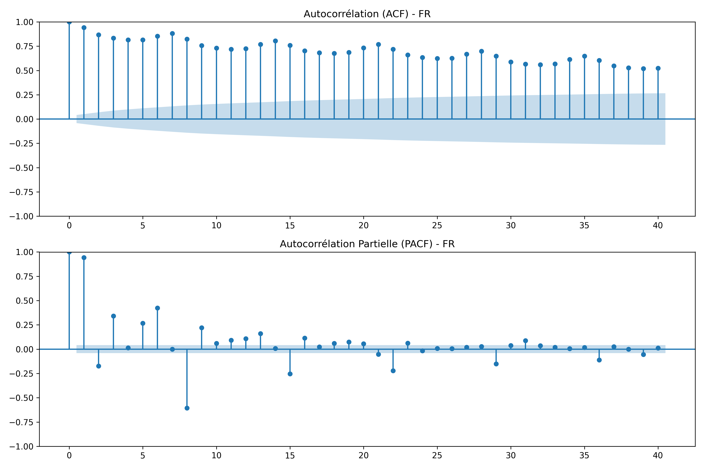
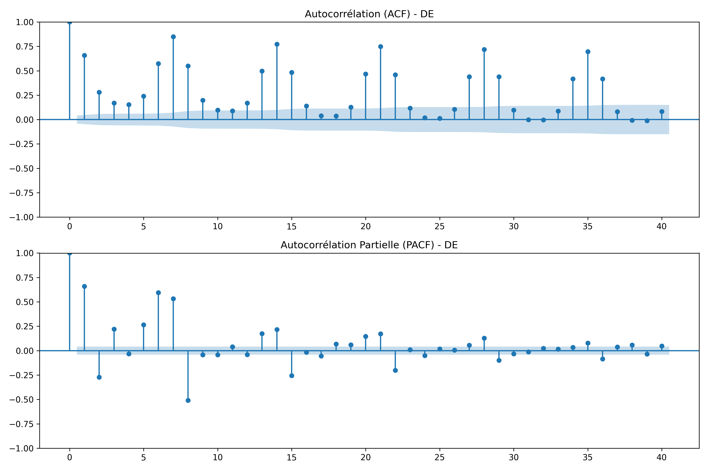

# Prévision de la consommation électrique en France et en Allemagne
## Comparaison des modèles ARIMA, SARIMA et ARIMAX

### 1. Description du projet et objectifs
Ce projet de recherche vise à modéliser et prévoir la consommation électrique journalière en France et en Allemagne à court terme (jour suivant) et à moyen terme (semaine suivante)[cite: 1]. Il repose sur l'évaluation comparative des performances prédictives de trois modèles économétriques : ARIMA, SARIMA et ARIMAX[cite: 1]. 

L'étude de ces deux pays permet d'analyser la dynamique de réseaux aux mix énergétiques contrastés : la France, dont la production est fortement dominée par le nucléaire, et l'Allemagne, engagée dans une transition massive vers les énergies renouvelables intermittentes (Energiewende)[cite: 1]. La modélisation ARIMAX inclura des variables climatiques (températures) et calendaires (jours fériés, week-ends) pour quantifier leur contribution respective à la qualité des prévisions, mesurée par les critères RMSE et MAE[cite: 1].

### 2. Travaux réalisés (Lot 1 : Ingénierie des données)
L'infrastructure de données a été construite et consolidée via trois modules Python :
* **Extraction de la charge électrique :** Requêtage de l'API ENTSO-E pour la période 2018-2023[cite: 1]. Agrégation en moyennes journalières (MW) et imputation des données manquantes par interpolation temporelle[cite: 1].
* **Variables exogènes :** Intégration des indicateurs calendaires (week-ends, jours fériés nationaux) et extraction des températures moyennes via l'API Open-Meteo, pondérées spatialement pour refléter la demande régionale[cite: 1].
* **Consolidation :** Création de la matrice de données `dataset_final.parquet` comprenant 2191 observations par pays.

### 3. Diagnostics économétriques et interprétation
Voici l'analyse de stationnarité pour la France et l'Allemagne :

L'analyse de stationnarité préalable à la modélisation (réalisée sur la série française) révèle une contradiction nécessitant un traitement spécifique :
* **Test de Dickey-Fuller Augmenté (ADF) :** Le test rejette l'hypothèse nulle d'une racine unitaire (p-value = 0.0076), ce qui suggère mathématiquement une série stationnaire.
* **Corrélogrammes (ACF et PACF) :** L'analyse visuelle contredit le test ADF. La fonction d'autocorrélation (ACF) présente une décroissance extrêmement lente, caractéristique d'une mémoire longue, avec des pics saisonniers stricts aux retards multiples de sept (7, 14, 21, 28).
* **Conclusion méthodologique :** Le résultat du test ADF est biaisé par la forte saisonnalité déterministe (cycle hebdomadaire de l'activité économique). La série de consommation n'est pas stationnaire. La spécification du modèle de référence SARIMA devra impérativement inclure un opérateur de différence saisonnière ($\Delta_7$) pour stabiliser la moyenne avant l'estimation des paramètres.
